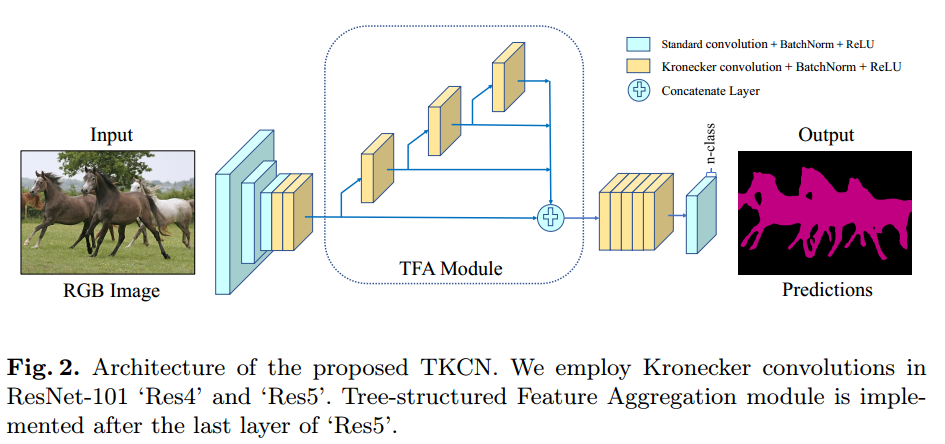

# Tree-structured Kronecker Convolutional Networks for Semantic Segmentation

## Abstract
Most existing semantic segmentation methods employ atrous convolution to enlarge the receptive field of filters, but neglect important
local contextual information. To tackle this issue, we firstly propose a novel Kronecker convolution which adopts Kronecker product to expand its kernel for taking into account the feature vectors neglected by atrous convolutions. Therefore, it can capture local contextual information and enlarge the field of view of filters simultaneously without introducing extra parameters. Secondly, we propose Tree-structured Feature Aggregation (TFA) module which follows a recursive rule to expand and forms a hierarchical structure. Thus, it can naturally learn representations of multi-scale objects and encode hierarchical contextual information in complex scenes. Finally, we design Tree-structured Kronecker Convolutional Networks (TKCN) that employs Kronecker convolution and TFA module. Extensive experiments on three datasets, PASCAL VOC 2012, PASCAL-Context and Cityscapes, verify the effectiveness of our proposed approach.

## Approach

    

## Performance
For VOC 2012, we evaluate the proposed TKCN model on test set without external data such as COCO dataset. 

For Cityscapes, the proposed TKCN only trains with the fine-labeled set.

Method | Conference | Backbone | PASCAL VOC 2012   test set  |Cityscapes   test set | PASCAL-Context   val set
---- | --- | --- | --- | --- | --- 
RefineNet |  CVPR2017  | ResNet-101  |-  | 73.6 |- 
SAC  |  ICCV2017  | ResNet-101  |-  | 78.1  |-
PSPNet |  CVPR2017  | ResNet-101  |-  |78.4 |-
DUC-HDC | WACV2018 | ResNet-101 |- |77.6 | -
AAF |   ECCV2018  | ResNet-101  | - |77.1 |-
BiSeNet |   ECCV2018  | ResNet-101  |-  |78.9|- 
PSANet |  ECCV2018  | ResNet-101  |-  |80.1| -
DFN  |  CVPR2018  | ResNet-101  |-  |79.3 |-
DSSPN | CVPR2018  | ResNet-101  |- |77.8 |-
CCL | CVPR2018  | ResNet-101  |- | - | 51.6
EncNet | CVPR2018  | ResNet-101  |- | - |51.7
DenseASPP  |  CVPR2018  | DenseNet-161  |- | 80.6|-
TKCN       | -|  ResNet-101 | - | 79.5 | 51.8

